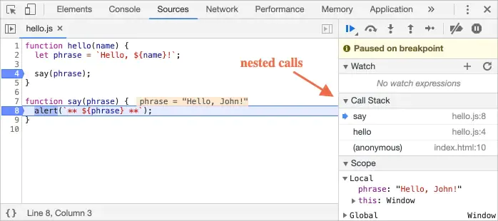
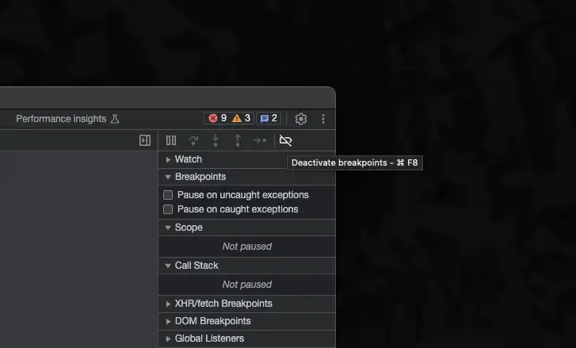
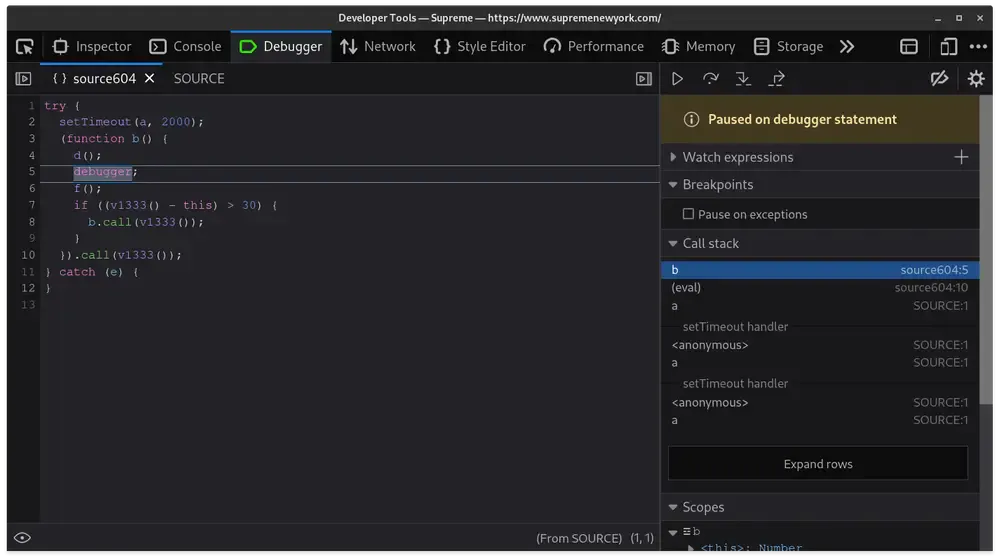
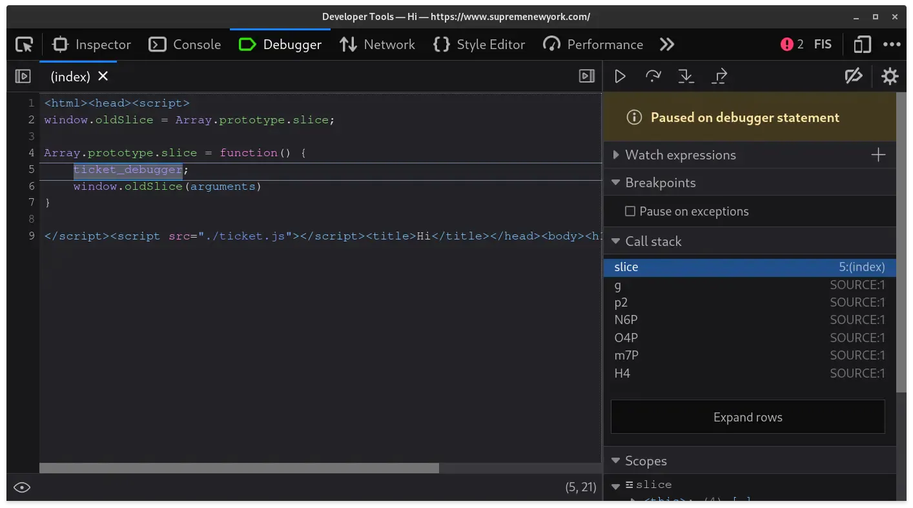

# 规避JavaScript反调试技术

[【原文】Evading JavaScript Anti-Debugging Techniques](https://www.nullpt.rs/evading-anti-debugging-techniques)

Debuggers serve as invaluable tools that empower developers to halt code execution and thoroughly analyze its behavior at any given moment. By utilizing a debugger, developers can efficiently identify and resolve issues within their code, making it an indispensable part of their toolkit.

Debuggers是一种很有用的工具，它使开发人员能够在任何给定时刻停止代码执行并彻底分析其行为。通过使用debugger，开发人员可以有效地识别和解决代码中的问题，使其成为工具包中不可或缺的一部分。



Debuggers are equally valuable tools for reverse-engineers, especially when dealing with obfuscated code that frequently employs name-mangling techniques for variables and functions. By utilizing debuggers, reverse-engineers can gain crucial insights into the functionality of obscured functions. Companies that employ client-side protection are aware of this fact and thus devise strategies to thwart attempts at debugging protected code.

对逆向工程师来说，调试器也是同样有价值的工具，特别是在处理经常对变量和函数使用名称混淆技术的混淆代码时。通过利用调试器，逆向工程师可以获得对模糊函数功能的关键洞察。采用客户端保护的公司意识到这一事实，因此设计策略来阻止调试受保护代码的尝试。

Once upon a time, whenever you tried to open your devtools on Supreme's website, you found yourself trapped in a pesky debugger loop. This made it incredibly annoying to reverse engineer their anti-bot scripts.

曾几何时，每当你试图在Supreme的网站上打开你的devtools时，你都会发现自己被困在一个讨厌的调试器循环中。这使得逆向工程他们的反机器人脚本变得非常烦人。

## 显而易见的方法 The Obvious Approach

In many browsers, there's an option to disable all breakpoints from triggering. While this approach will prevent getting stuck in a loop, it comes with a trade-off – the debugger's functionality for further analysis becomes unavailable.

在许多浏览器中，有一个选项可以禁用所有断点的触发。虽然这种方法可以防止陷入循环，但它也有一个代价——调试器用于进一步分析的功能变得不可用。



For complex scripts like the anti-bot employed by Supreme, this approach was simply not an option.

对于像Supreme所使用的反机器人这样的复杂脚本，这种方法就不在选项之列了。

## Trying an Extension

Greasyfork scripts such as Anti Anti-debugger attempt to bypass these debugger traps by overriding the caller's function body, removing the debugger statements, and eval the new function. While this approach seemed promising, it unfortunately does not succeed with JScrambler-protected scripts due to the evaluation of debugger traps in a distinct context.

诸如Anti Anti-debugger之类的Greasyfork脚本试图通过覆盖调用者的函数体、删除调试器语句并计算新函数来绕过这些调试器陷阱。虽然这种方法看起来很有希望，但不幸的是，由于在不同的上下文中对调试器陷阱进行评估，它不能成功地处理受jscrambler保护的脚本。

They also utilize integrity checks and hide debugger calls inside of further obfuscated eval functions.

它们还利用完整性检查并将调试器调用隐藏在进一步混淆的eval函数中。



## The Final Approach

The approach my friend Jordin and I ultimately adopted involved renaming the debugger keyword entirely. By renaming it to something like "banana," the debugger would no longer trigger on occurrences of the debugger keyword. To achieve this, we built customized version of Firefox. If you're interested in trying this out, here's the patch we came up with.

我和我的朋友Jordin最终采用的方法是完全重命名调试器关键字。通过将其重命名为类似“banana”的东西，调试器将不再在出现调试器关键字时触发。为了实现这一点，我们构建了定制版本的Firefox。如果你有兴趣尝试这个，这是我们想出的补丁。

```h
--- a/js/src/frontend/ReservedWords.h
+++ b/js/src/frontend/ReservedWords.h
@@ -20,7 +20,7 @@
   MACRO(catch, catch_, TokenKind::Catch)                \
   MACRO(const, const_, TokenKind::Const)                \
   MACRO(continue, continue_, TokenKind::Continue)       \
-  MACRO(debugger, debugger, TokenKind::Debugger)        \
+  MACRO(ticket_debugger, debugger, TokenKind::Debugger) \
   MACRO(default, default_, TokenKind::Default)          \
   MACRO(delete, delete_, TokenKind::Delete)             \
   MACRO(do, do_, TokenKind::Do)                         \
--- a/js/src/vm/CommonPropertyNames.h
+++ b/js/src/vm/CommonPropertyNames.h
@@ -107,7 +107,7 @@
   MACRO_(currencySign, currencySign, "currencySign")  \
   MACRO_(day, day, "day")                             \
   MACRO_(dayPeriod, dayPeriod, "dayPeriod")           \
-  MACRO_(debugger, debugger, "debugger")              \
+  MACRO_(ticket_debugger, debugger, "ticket_debugger")\
   MACRO_(decimal, decimal, "decimal")                 \
```

Finding this was daunting as reading through a browser's codebase is never a fun time. A simple grep for a keyword like "debugger" could produce thousands of results, making the search even more challenging.

发现这一点是令人生畏的，因为阅读浏览器的代码库从来都不是一件有趣的事情。对“debugger”这样的关键字进行简单的grep可能会产生数千个结果，从而使搜索更具挑战性。

Many builds later, we tested our patch by loading the anti-bot script ticket.js and hooking Array.prototype.slice to call our new ticket_debugger keyword.

在多次构建之后，我们通过加载反bot脚本ticket.js并挂钩Array.prototype.slice来调用新的ticket_debugger关键字来测试补丁。



## It works!

We introduced a new ticket_debugger keyword, which not only triggers a breakpoint but also resolves the issue of the previous debugger infinite loop. We also extended this custom browser to automatically retrieve the anti-bot's obfuscated encryption round keys and convert them back to their original form, but I'll cover that in a later post :)

我们引入了一个新的ticket_debugger关键字，它不仅触发了一个断点，而且还解决了之前调试器无限循环的问题。我们还扩展了这个自定义浏览器，以自动检索反机器人的模糊加密轮密钥，并将其转换回原始形式，但我将在以后的帖子中介绍:)
